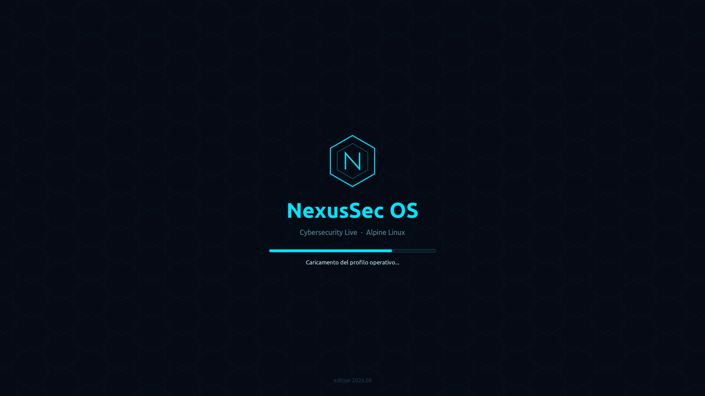
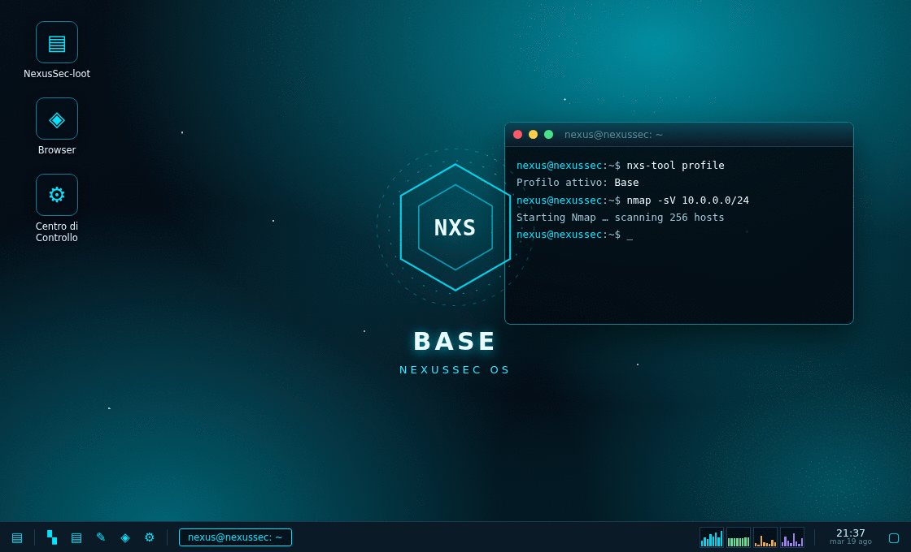
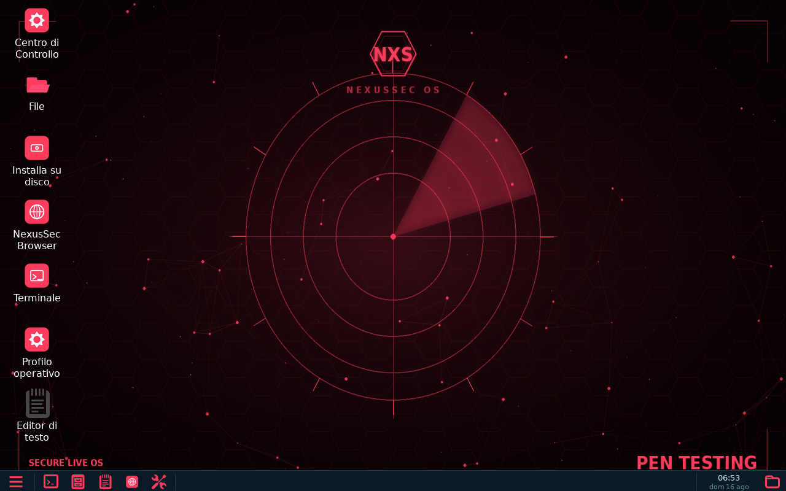
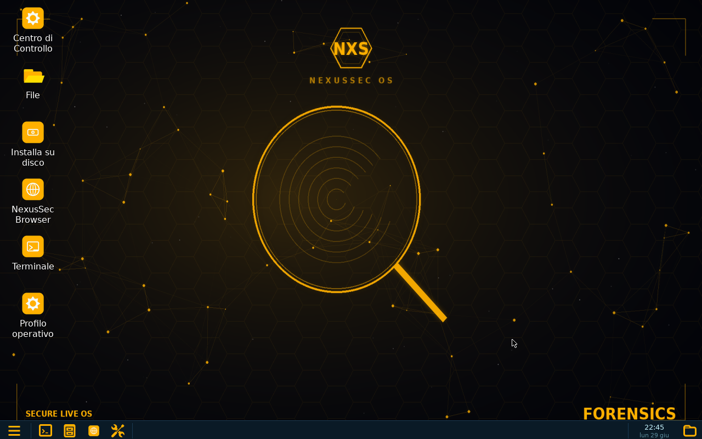
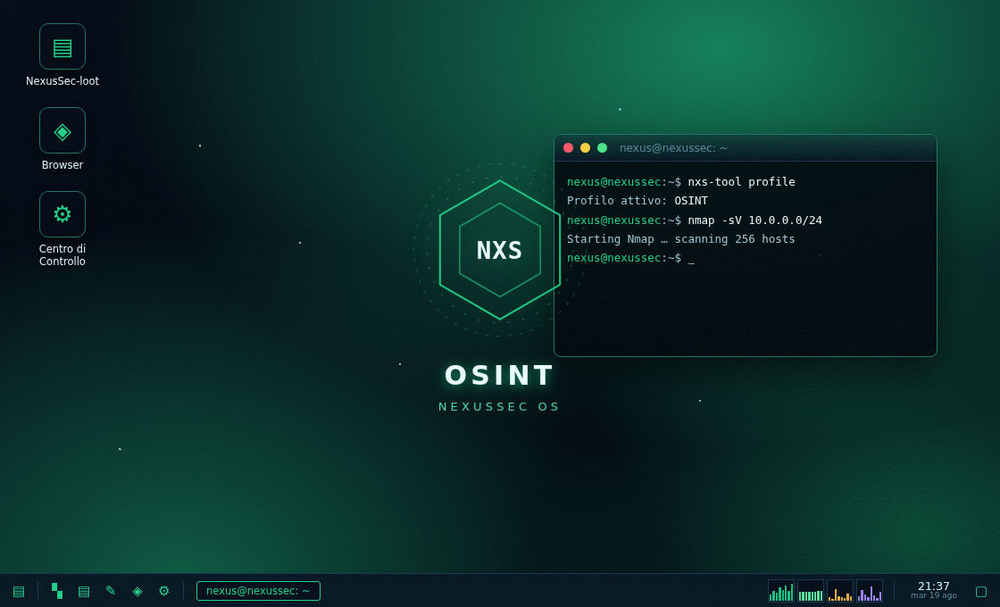
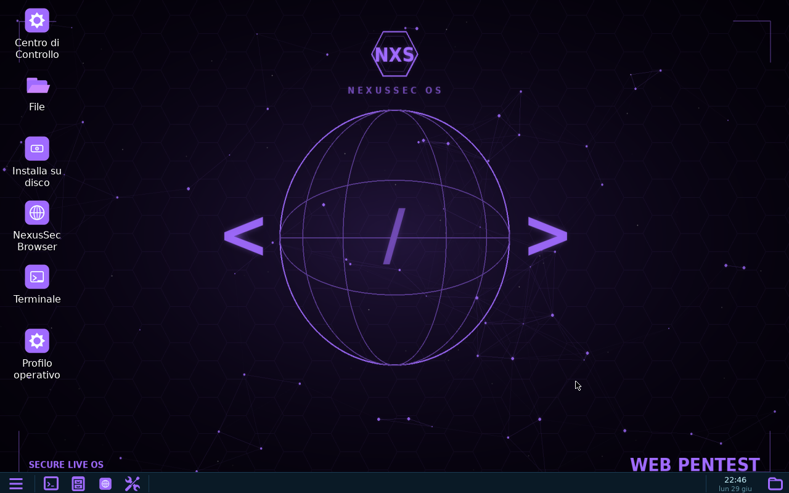
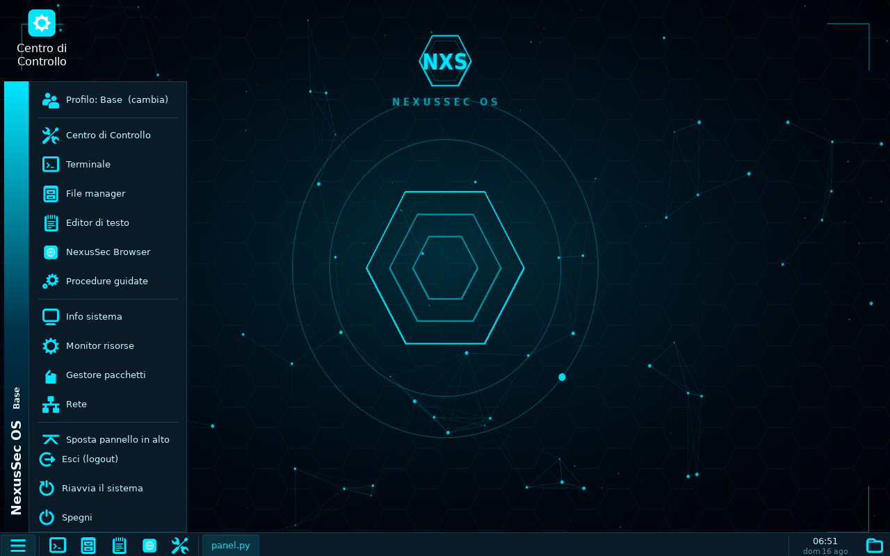
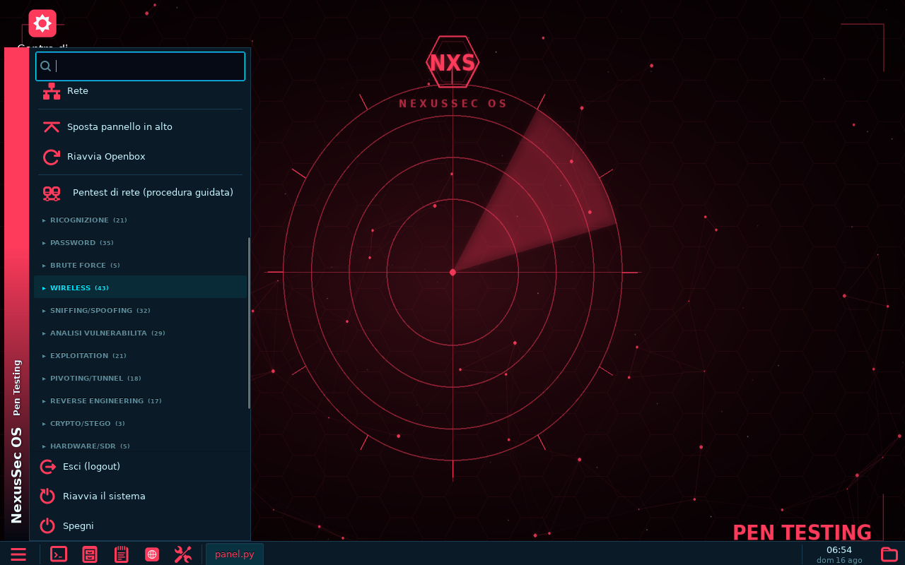
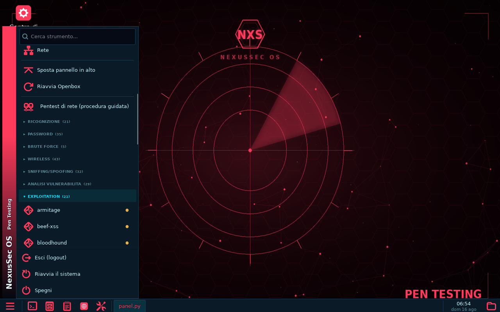

# NexusSecOS-Arsenal

Vetrina, download e **repository pacchetti** di **NexusSec OS** — distro Linux
live x86_64 per la **cybersecurity**, basata su Alpine (musl · apk · OpenRC),
desktop Openbox con pannello e Centro di Controllo nativi in Python (GTK3) e
**profili operativi dinamici** (Pen Testing · Digital Forensics · OSINT · Web).

L'idea: la copertura di strumenti di Kali/Parrot, ma con ISO molto più piccola e
tool **on-demand** (apk · container Podman · pip), ciascuno in **sandbox**.

Include un **browser integrato stealth**: di default naviga in modo **anonimo**
(traffico via **Tor**, IP nascosto) e **senza lasciare tracce** locali
(cookie/cronologia/cache solo in RAM), con **interruttore** in barra per passare
al volo alla navigazione normale. Interfaccia a schede con **preferiti** (mostra
la **favicon** reale dei siti, anche nella barra laterale ridotta) e **tema
scuro** coerente con l'ambiente NexusSec.

## Procedure guidate (Wizard)

Oltre ai tool singoli, NexusSec include **procedure guidate**: catene di
strumenti **orchestrate** che trasformano un'operazione complessa in pochi clic.
Non sostituiscono l'esperienza dell'esperto — la **incapsulano** in flussi
ripetibili, versatili e trasparenti. Ogni procedura (Pentest di rete, OSINT su
dominio, Scan web, Forensics) si configura al volo dall'interfaccia:

- **Modalità** (intensità): *Leggero* / *Approfondito* — regola profondità e
  ampiezza (es. porte comuni vs tutte le porte, crawl minimo vs esteso).
- **Opzioni** a spunta: attivi/disattivi singole fasi (rilevamento OS, script
  vulnerabilità NSE, UDP, enumerazione SMB, WAF, ...), con il **conteggio degli
  step** aggiornato in tempo reale.
- **Stealth ON/OFF** (mostrato solo dove ha senso): dove praticabile instrada i
  tool **via Tor** (torsocks/proxychains) per nascondere l'IP, con **esito
  onesto per step** — *via Tor* / *non anonimizzabile (pacchetti raw)* / *gira in
  container* / *locale*. Niente false promesse: se Tor non è disponibile, gli
  step anonimizzabili vengono **saltati** per non esporre l'IP reale.
- **Catena dati**: l'output di un tool diventa l'input del successivo
  (es. *ping sweep → estrai host vivi → scansiona solo quelli*), con salto
  automatico degli step il cui input è vuoto.

Risultati e log finiscono in `~/NexusSec-loot/`. È incluso un **costruttore
grafico** per creare **wizard personalizzati** (scegli i tool dal catalogo,
definisci modalità, opzioni, comportamento stealth per step e la catena dati)
che si aggiungono all'elenco **senza scrivere codice**.

## Documentazione

- **[Manuale utente](docs/manuale.html)** — avvio, profili, menu, metodi dei tool,
  procedure guidate, browser stealth, persistenza e comandi CLI.
- **[Copertura dell'arsenale](docs/copertura-arsenale.html)** — confronto riga per
  riga con `kali-linux-everything` / `parrot-tools-full`.

## Download ISO

L'immagine ISO (~0.5 GB, boot BIOS+EFI) è pubblicata nella sezione
**[Releases](../../releases)** (i file ISO superano il limite del repository git,
quindi sono allegati come *release asset*).

In VirtualBox: VM Linux 64-bit, ≥ 2 GB RAM (3–4 GB se usi i container
Forensics/Web), boot dall'ISO.

## Screenshot

All'avvio una **splashscreen flat** con barra di caricamento accompagna la
preparazione del desktop:



Desktop reali della live (QEMU/KVM). Cambiando profilo cambiano **sfondo,
accent del pannello e tema delle icone** (anche cartelle e browser).

| Base | Pen Testing |
|---|---|
|  |  |

| Digital Forensics | OSINT | Web Pentest |
|---|---|---|
|  |  |  |

Menu start con ricerca, strumenti raggruppati per categoria e stato installato.
La voce **Profilo (cambia)** e le utilita' di sistema restano sempre in cima,
visibili subito senza scorrere; le categorie di strumenti del profilo attivo
seguono piu' in basso (a fisarmonica, con il conteggio per categoria):

| Menu (Base) | Menu (Pen Testing) — categorie |
|---|---|
|  |  |

Ogni categoria si espande al clic e mostra gli strumenti (pallino = da
installare, si installa al primo avvio):



## Repository pacchetti (apk)

I pacchetti compilati per NexusSec OS non presenti nei repo Alpine (`dmitry`,
`foremost`, `medusa`, `chkrootkit`, `rkhunter`, `bulk-extractor`) sono firmati e
serviti via **GitHub Pages**:

```
https://dplusos21.github.io/NexusSecOS-Arsenal/
```

Per usarlo su un sistema Alpine/NexusSec:

```sh
# 1) fidati della chiave pubblica del repo
wget -O /etc/apk/keys/nexussecos-arsenal.rsa.pub \
  https://dplusos21.github.io/NexusSecOS-Arsenal/nexussecos-arsenal.rsa.pub

# 2) aggiungi il repo
echo "https://dplusos21.github.io/NexusSecOS-Arsenal" >> /etc/apk/repositories

# 3) aggiorna e installa
apk update
apk add foremost medusa bulk-extractor
```

Su NexusSec OS questo è **già configurato**: la chiave è in `/etc/apk/keys/` e il
repo è aggiunto all'avvio, quindi `nxs-tool install <tool>` li scarica da qui.

## Catalogo strumenti e confronto con Kali / Parrot

Catalogo **curato**: **127 strumenti**, uno o piu' per ogni fase operativa, scelti tra i migliori/piu' efficienti ed evitando i doppioni superati (es. un solo fork di *foremost*, *ffuf*/*feroxbuster* al posto dei vecchi dir-buster). Tutti **on-demand** (`nxs-tool install <nome>` o le procedure guidate); fonti verificate vive (0 rotte).

**Copertura:** 127/127 strumenti fanno parte dell'arsenale di **Kali** e **Parrot** — il catalogo e' costruito apposta come sottoinsieme del loro set. La differenza non e' *quali* strumenti, ma **come**: NexusSec li scarica **al bisogno** su una ISO di **~0.5 GB** (Kali ~4 GB, Parrot ~5-6 GB), ciascuno in sandbox.

> **Arsenale esteso (on-demand):** oltre a questo nucleo curato, il catalogo
> completo conta ora **443 strumenti** su 16 categorie (incluse **Crypto/Stego**
> e **Hardware/SDR**). I ~300 tool aggiuntivi sono raggiunti al volo tramite il
> **container Kali condiviso** (`kali-rolling`): compaiono gia' nei menu e, al
> primo avvio, vengono installati ed eseguiti. Rispetto ai metapacchetti
> `kali-linux-everything` / `parrot-tools-full` la copertura sugli strumenti
> reali e' **153/154** — le uniche voci escluse sono librerie Python o CLI di
> base (non programmi da menu). Confronto completo, riga per riga, in fondo a
> questa sezione e nella vista HTML [`docs/copertura-arsenale.html`](docs/copertura-arsenale.html).

Legenda canale: **Alpine apk** = pacchetto nativo Alpine · **Arsenal** = .apk compilato da noi (GitHub Pages) · **Container** / **Kali (container)** = Podman (immagine upstream o `kali-rolling`) · **PyPI** / **Git** = pipx. Kali/Parrot: ✓ = incluso nell'arsenale.

| # | Programma | Funzione | Canale NexusSec | Kali | Parrot |
|---|---|---|---|---|---|
| | **Ricognizione / Scanning** (14) | | | | |
| 1 | `arp-scan` | Discovery host su LAN via ARP | Alpine apk | ✓ | ✓ |
| 2 | `autorecon` | Ricognizione multi-thread automatica (orchestratore) | PyPI | ✓ | ✓ |
| 3 | `enum4linux` | Enumerazione SMB/Windows | Git (pipx) | ✓ | ✓ |
| 4 | `fping` | Ping parallelo di molti host/range | Alpine apk | ✓ | ✓ |
| 5 | `hping3` | Generatore/analizzatore pacchetti TCP/IP | Alpine apk | ✓ | ✓ |
| 6 | `masscan` | Scanner di porte ad altissima velocita' | Alpine apk | ✓ | ✓ |
| 7 | `naabu` | Port scanner veloce (ProjectDiscovery) | Alpine apk | ✓ | ✓ |
| 8 | `nbtscan` | Scanner nomi NetBIOS | Alpine apk | ✓ | ✓ |
| 9 | `netdiscover` | Discovery host ARP attivo/passivo | Alpine apk | ✓ | ✓ |
| 10 | `nmap` | Scanner di rete e porte | Alpine apk | ✓ | ✓ |
| 11 | `onesixtyone` | Brute-force community string SNMP (via Kali rolling) | Kali (container) | ✓ | ✓ |
| 12 | `sipvicious` | Audit di sistemi SIP/VoIP (via Kali rolling) | Kali (container) | ✓ | ✓ |
| 13 | `smbmap` | Enumerazione share SMB | PyPI | ✓ | ✓ |
| 14 | `snmpwalk` | Interrogazione/enumerazione SNMP | Alpine apk | ✓ | ✓ |
| | **OSINT** (12) | | | | |
| 15 | `amass` | Mappatura attack surface / sottodomini | Container | ✓ | ✓ |
| 16 | `dmitry` | Deepmagic info gathering (whois/porte/sub) | Arsenal | ✓ | ✓ |
| 17 | `dnsrecon` | Enumerazione DNS | Alpine apk | ✓ | ✓ |
| 18 | `holehe` | Account associati a una email | PyPI | ✓ | ✓ |
| 19 | `metagoofil` | Estrazione metadati da documenti pubblici (script: clone + venv dedicato) | Git | ✓ | ✓ |
| 20 | `recon-ng` | Framework web recon (OSINT) | Alpine apk | ✓ | ✓ |
| 21 | `sherlock` | Username su social (container) | Container | ✓ | ✓ |
| 22 | `shodan` | CLI Shodan | Alpine apk | ✓ | ✓ |
| 23 | `spiderfoot` | Automazione OSINT (via Kali rolling: l'immagine spiderfoot/spiderfoot non esiste piu') | Kali (container) | ✓ | ✓ |
| 24 | `subfinder` | Scoperta sottodomini passiva | Container | ✓ | ✓ |
| 25 | `theharvester` | Email/sottodomini da fonti pubbliche. Container ufficiale upstream (override entrypoint: l'EP di default e' il server REST) | Container | ✓ | ✓ |
| 26 | `whois` | Interrogazione WHOIS | Alpine apk | ✓ | ✓ |
| | **Web application** (18) | | | | |
| 27 | `burpsuite` | Burp Suite Community (via Kali rolling: nessuna immagine OCI ufficiale) | Kali (container) | ✓ | ✓ |
| 28 | `commix` | Command injection exploiter | PyPI | ✓ | ✓ |
| 29 | `dalfox` | Scanner XSS | Container | ✓ | ✓ |
| 30 | `feroxbuster` | Brute-force contenuti web (Rust, ricorsivo) via Kali rolling: l'immagine ghcr epi052 non esiste piu' | Kali (container) | ✓ | ✓ |
| 31 | `ffuf` | Fuzzer web veloce | Alpine apk | ✓ | ✓ |
| 32 | `gobuster` | Brute force dir/dns/vhost | Alpine apk | ✓ | ✓ |
| 33 | `httrack` | Copia offline di interi siti web | Alpine apk | ✓ | ✓ |
| 34 | `joomscan` | Scanner di vulnerabilita' Joomla (via Kali rolling) | Kali (container) | ✓ | ✓ |
| 35 | `nikto` | Scanner vulnerabilita' web server | Alpine apk | ✓ | ✓ |
| 36 | `nuclei` | Scanner basato su template | Alpine apk | ✓ | ✓ |
| 37 | `sqlmap` | SQL injection automatico | Alpine apk | ✓ | ✓ |
| 38 | `sslscan` | Analisi configurazione SSL/TLS | Alpine apk | ✓ | ✓ |
| 39 | `wafw00f` | Rileva i WAF | PyPI | ✓ | ✓ |
| 40 | `wapiti` | Scanner di vulnerabilita' web black-box (via Kali rolling) | Kali (container) | ✓ | ✓ |
| 41 | `weevely` | Web shell PHP stealth + gestione (via Kali rolling) | Kali (container) | ✓ | ✓ |
| 42 | `whatweb` | Fingerprinting tecnologie web | Container | ✓ | ✓ |
| 43 | `wpscan` | Scanner WordPress (container) | Container | ✓ | ✓ |
| 44 | `zaproxy` | OWASP ZAP - scanner sicurezza web | Alpine apk | ✓ | ✓ |
| | **Exploitation / Post-exploit** (9) | | | | |
| 45 | `beef-xss` | Framework di exploitation del browser (via Kali rolling) | Kali (container) | ✓ | ✓ |
| 46 | `bloodhound-python` | Ingestor Python di BloodHound (raccolta dati Active Directory) | PyPI | ✓ | ✓ |
| 47 | `evil-winrm` | Shell WinRM per Windows (immagine mantenuta da ParrotSec) | Container | ✓ | ✓ |
| 48 | `exploitdb` | Exploit-DB + searchsploit (ricerca exploit offline, via Kali rolling) | Kali (container) | ✓ | ✓ |
| 49 | `impacket` | Script Impacket (secretsdump/psexec/... via Kali rolling) | Kali (container) | ✓ | ✓ |
| 50 | `metasploit` | Framework di exploit (container Rapid7) | Container | ✓ | ✓ |
| 51 | `netexec` | CrackMapExec successore (SMB/LDAP/WinRM). Immagine mantenuta da ParrotSec (entrypoint nxc) | Container | ✓ | ✓ |
| 52 | `routersploit` | Framework di exploit per dispositivi embedded/router (via Kali rolling) | Kali (container) | ✓ | ✓ |
| 53 | `set` | Social-Engineer Toolkit (via Kali rolling) | Kali (container) | ✓ | ✓ |
| | **Password / Hash** (8) | | | | |
| 54 | `cewl` | Wordlist dai contenuti di un sito (via Kali rolling) | Kali (container) | ✓ | ✓ |
| 55 | `crunch` | Generatore di wordlist (via Kali rolling) | Kali (container) | ✓ | ✓ |
| 56 | `fcrackzip` | Crack di ZIP protetti (via Kali rolling) | Kali (container) | ✓ | ✓ |
| 57 | `hashcat` | Cracking hash GPU/CPU | Alpine apk | ✓ | ✓ |
| 58 | `hashid` | Identifica il tipo di hash (via Kali rolling) | Kali (container) | ✓ | ✓ |
| 59 | `john` | John the Ripper: cracking hash | Alpine apk | ✓ | ✓ |
| 60 | `ophcrack` | Crack password Windows con rainbow table (via Kali rolling) | Kali (container) | ✓ | ✓ |
| 61 | `pdfcrack` | Recupero password di PDF | Alpine apk | ✓ | ✓ |
| | **Brute force online** (5) | | | | |
| 62 | `crowbar` | Brute-force per RDP/SSH/OpenVPN (via Kali rolling) | Kali (container) | ✓ | ✓ |
| 63 | `hydra` | Brute force login multi-protocollo | Alpine apk | ✓ | ✓ |
| 64 | `medusa` | Brute-forcer login paralleli | Arsenal | ✓ | ✓ |
| 65 | `ncrack` | Brute-force di autenticazioni di rete (via Kali rolling) | Kali (container) | ✓ | ✓ |
| 66 | `patator` | Brute-forcer modulare multi-servizio (via Kali rolling) | Kali (container) | ✓ | ✓ |
| | **Sniffing / MITM** (13) | | | | |
| 67 | `bettercap` | MITM e attacchi di rete | Alpine apk | ✓ | ✓ |
| 68 | `dnschef` | Proxy DNS per MITM/redirect (via Kali rolling) | Kali (container) | ✓ | ✓ |
| 69 | `driftnet` | Estrae immagini dal traffico di rete (via Kali rolling) | Kali (container) | ✓ | ✓ |
| 70 | `dsniff` | Suite sniffing password/credenziali (via Kali rolling) | Kali (container) | ✓ | ✓ |
| 71 | `ettercap` | Suite MITM | Alpine apk | ✓ | ✓ |
| 72 | `mitmproxy` | Proxy HTTP/HTTPS interattivo (MITM) | Alpine apk | ✓ | ✓ |
| 73 | `netsniff-ng` | Toolkit sniffing/networking zero-copy (via Kali rolling) | Kali (container) | ✓ | ✓ |
| 74 | `ngrep` | grep sul traffico di rete | Alpine apk | ✓ | ✓ |
| 75 | `responder` | LLMNR/NBT-NS/MDNS poisoner | Alpine apk | ✓ | ✓ |
| 76 | `sslsplit` | MITM trasparente su SSL/TLS (via Kali rolling) | Kali (container) | ✓ | ✓ |
| 77 | `tcpdump` | Cattura pacchetti da CLI | Alpine apk | ✓ | ✓ |
| 78 | `tshark` | Wireshark da riga di comando | Alpine apk | ✓ | ✓ |
| 79 | `wireshark` | Analizzatore di protocolli di rete (GUI) | Alpine apk | ✓ | ✓ |
| | **Wireless** (8) | | | | |
| 80 | `aircrack-ng` | Audit Wi-Fi | Alpine apk | ✓ | ✓ |
| 81 | `cowpatty` | Crack di PSK WPA/WPA2 (via Kali rolling) | Kali (container) | ✓ | ✓ |
| 82 | `kismet` | Rilevatore/sniffer di reti wireless | Alpine apk | ✓ | ✓ |
| 83 | `mdk4` | Stress/attacco su reti Wi-Fi 802.11 (via Kali rolling) | Kali (container) | ✓ | ✓ |
| 84 | `pixiewps` | Attacco WPS offline (Pixie Dust) | Alpine apk | ✓ | ✓ |
| 85 | `reaver` | Attacco WPS su router Wi-Fi (via Kali rolling) | Kali (container) | ✓ | ✓ |
| 86 | `wifiphisher` | Attacchi di phishing/rogue-AP su Wi-Fi (via Kali rolling) | Kali (container) | ✓ | ✓ |
| 87 | `wifite` | Automazione attacchi wireless (WEP/WPA/WPS) | Git (pipx) | ✓ | ✓ |
| | **Reverse engineering** (10) | | | | |
| 88 | `apktool` | Reverse/rebuild di APK Android (via Kali rolling) | Kali (container) | ✓ | ✓ |
| 89 | `binutils` | objdump/readelf/nm: analisi binari | Alpine apk | ✓ | ✓ |
| 90 | `flare-floss` | Estrazione stringhe offuscate da malware (FLARE FLOSS) | PyPI | ✓ | ✓ |
| 91 | `gdb` | Debugger GNU | Alpine apk | ✓ | ✓ |
| 92 | `ghidra` | Suite di reverse engineering (NSA) | Alpine apk | ✓ | ✓ |
| 93 | `jadx` | Decompilatore Dalvik/APK -> Java | Alpine apk | ✓ | ✓ |
| 94 | `ltrace` | Traccia chiamate di libreria | Alpine apk | ✓ | ✓ |
| 95 | `pev` | Toolkit di analisi di eseguibili PE | Alpine apk | ✓ | ✓ |
| 96 | `radare2` | Framework di reverse engineering | Alpine apk | ✓ | ✓ |
| 97 | `strace` | Traccia le system call | Alpine apk | ✓ | ✓ |
| | **Digital forensics** (21) | | | | |
| 98 | `autopsy` | Front-end forense (via Kali rolling: l'immagine sleuthkit/autopsy non esiste piu') | Kali (container) | ✓ | ✓ |
| 99 | `binwalk` | Analisi/carving firmware | Alpine apk | ✓ | ✓ |
| 100 | `bulk-extractor` | Estrazione feature (email/URL/cc) da immagini | Arsenal | ✓ | ✓ |
| 101 | `chkrootkit` | Rilevazione rootkit (locale) | Arsenal | ✓ | ✓ |
| 102 | `clamav` | Antivirus | Alpine apk | ✓ | ✓ |
| 103 | `dc3dd` | dd forense patchato (DC3) con log/hash (via Kali rolling) | Kali (container) | ✓ | ✓ |
| 104 | `dcfldd` | dd forense con hashing on-the-fly (via Kali rolling) | Kali (container) | ✓ | ✓ |
| 105 | `ddrescue` | Copia/recupero dati da dischi danneggiati | Alpine apk | ✓ | ✓ |
| 106 | `exiftool` | Lettura/scrittura metadati | Alpine apk | ✓ | ✓ |
| 107 | `extundelete` | Recupero file cancellati da ext3/ext4 | Alpine apk | ✓ | ✓ |
| 108 | `foremost` | File carving per signature | Arsenal | ✓ | ✓ |
| 109 | `ghex` | Editor esadecimale grafico (GTK) | Alpine apk | ✓ | ✓ |
| 110 | `guymager` | Imager forense grafico (via Kali rolling) | Kali (container) | ✓ | ✓ |
| 111 | `hexedit` | Editor esadecimale da terminale | Alpine apk | ✓ | ✓ |
| 112 | `rkhunter` | Rootkit Hunter (scansione integrita') | Arsenal | ✓ | ✓ |
| 113 | `sleuthkit` | The Sleuth Kit: file system forensics | Alpine apk | ✓ | ✓ |
| 114 | `steghide` | Steganografia | Alpine apk | ✓ | ✓ |
| 115 | `stegseek` | Crack steghide ultra-veloce (container: mhash assente in Alpine) | Container | ✓ | ✓ |
| 116 | `testdisk` | Recupero partizioni/file (con photorec) | Alpine apk | ✓ | ✓ |
| 117 | `volatility3` | Analisi memoria RAM (Volatility 3) | Alpine apk | ✓ | ✓ |
| 118 | `yara` | Pattern matching malware | Alpine apk | ✓ | ✓ |
| | **Anonimato** (4) | | | | |
| 119 | `macchanger` | Cambia l'indirizzo MAC dell'interfaccia | Alpine apk | ✓ | ✓ |
| 120 | `proxychains-ng` | Instrada connessioni TCP via proxy/Tor | Alpine apk | ✓ | ✓ |
| 121 | `tor` | Rete di anonimizzazione (onion routing) | Alpine apk | ✓ | ✓ |
| 122 | `torsocks` | Fa passare un'applicazione attraverso Tor | Alpine apk | ✓ | ✓ |
| | **Pivoting / Tunneling** (3) | | | | |
| 123 | `ncat` | Netcat di Nmap (con TLS/proxy) | Alpine apk | ✓ | ✓ |
| 124 | `netcat` | Coltellino svizzero TCP/UDP (bind/reverse shell) | Alpine apk | ✓ | ✓ |
| 125 | `socat` | Relay bidirezionale multiprotocollo (tunnel/pivot) | Alpine apk | ✓ | ✓ |
| | **Analisi vulnerabilita'** (1) | | | | |
| 126 | `lynis` | Audit di hardening/sicurezza del sistema | Alpine apk | ✓ | ✓ |
| | **Reporting** (1) | | | | |
| 127 | `cherrytree` | Note gerarchiche per report/appunti di pentest | Alpine apk | ✓ | ✓ |

> Presenza in Kali cross-verificata sull'indice `Packages` di `kali-rolling` unito alla base Debian *bookworm* (su cui Kali e Parrot 6 sono costruiti) e alla lista ufficiale `kali.org/tools`; Parrot importa l'intero arsenale Kali oltre alla base Debian, quindi la copertura coincide.


### Copertura completa dell'arsenale Kali / Parrot

Confronto riga per riga della tabella metapacchetti `kali-linux-everything` /
`parrot-tools-full` con il catalogo NexusSec (443 tool). Metodo su NexusSec:
`apk` nativo Alpine · `kali` container Kali condiviso · `pip` (pipx) · `ctr`
container Podman · `git` clone+venv.

<details>
<summary><b>Mostra tutti i 443 strumenti del catalogo</b> (per categoria, con metodo e presenza in Kali/Parrot)</summary>

| Categoria / Strumento | Metodo | Kali | Parrot |
|---|---|:--:|:--:|
| **Ricognizione** (30) | | | |
| `0trace` | container Kali | ✅ | ✅ |
| `2ping` | container Kali | ✅ | ✅ |
| `amap` | container Kali | ✅ | ✅ |
| `arp-scan` | apk nativo | ✅ | ✅ |
| `arping` | container Kali | ✅ | ✅ |
| `autorecon` | pip/pipx | ✅ | ✅ |
| `braa` | container Kali | ✅ | ✅ |
| `dnswalk` | container Kali | ✅ | ✅ |
| `enum4linux` | pip/pipx | ✅ | ✅ |
| `firewalk` | container Kali | ✅ | ✅ |
| `fping` | apk nativo | ✅ | ✅ |
| `fragrouter` | container Kali | ✅ | ✅ |
| `hping3` | apk nativo | ✅ | ✅ |
| `ike-scan` | container Kali | ✅ | ✅ |
| `intrace` | container Kali | ✅ | ✅ |
| `irpas` | container Kali | ✅ | ✅ |
| `masscan` | apk nativo | ✅ | ✅ |
| `massdns` | container Kali | ✅ | ✅ |
| `naabu` | apk nativo | ✅ | ✅ |
| `nbtscan` | apk nativo | ✅ | ✅ |
| `netdiscover` | apk nativo | ✅ | ✅ |
| `nmap` | apk nativo | ✅ | ✅ |
| `onesixtyone` | container Kali | ✅ | ✅ |
| `p0f` | container Kali | ✅ | ✅ |
| `sipvicious` | container Kali | ✅ | ✅ |
| `smbmap` | pip/pipx | ✅ | ✅ |
| `snmpwalk` | apk nativo | ✅ | ✅ |
| `thc-ipv6` | container Kali | ✅ | ✅ |
| `unicornscan` | container Kali | ✅ | ✅ |
| `zenmap` | container Kali | ✅ | ✅ |
| **OSINT** (32) | | | |
| `altdns` | container Kali | ✅ | ✅ |
| `amass` | container Podman | ✅ | ✅ |
| `assetfinder` | container Kali | ✅ | ✅ |
| `dmitry` | apk nativo | ✅ | ✅ |
| `dnsenum` | container Kali | ✅ | ✅ |
| `dnsmap` | container Kali | ✅ | ✅ |
| `dnsrecon` | apk nativo | ✅ | ✅ |
| `dnstracer` | container Kali | ✅ | ✅ |
| `email2phonenumber` | container Kali | ✅ | ✅ |
| `emailharvester` | container Kali | ✅ | ✅ |
| `fierce` | container Kali | ✅ | ✅ |
| `findomain` | container Kali | ✅ | ✅ |
| `holehe` | pip/pipx | ✅ | ✅ |
| `instaloader` | container Kali | ✅ | ✅ |
| `linkedin2username` | container Kali | ✅ | ✅ |
| `metagoofil` | git+venv | ✅ | ✅ |
| `netmask` | container Kali | ✅ | ✅ |
| `photon` | container Kali | ✅ | ✅ |
| `recon-ng` | apk nativo | ✅ | ✅ |
| `sherlock` | container Podman | ✅ | ✅ |
| `shodan` | apk nativo | ✅ | ✅ |
| `smtp-user-enum` | container Kali | ✅ | ✅ |
| `snmp-check` | container Kali | ✅ | ✅ |
| `spiderfoot` | container Kali | ✅ | ✅ |
| `subfinder` | container Podman | ✅ | ✅ |
| `sublist3r` | container Kali | ✅ | ✅ |
| `swaks` | container Kali | ✅ | ✅ |
| `theharvester` | container Podman | ✅ | ✅ |
| `tookie-osint` | container Kali | ✅ | ✅ |
| `twofi` | container Kali | ✅ | ✅ |
| `urlcrazy` | container Kali | ✅ | ✅ |
| `whois` | apk nativo | ✅ | ✅ |
| **Web** (69) | | | |
| `apache-users` | container Kali | ✅ | ✅ |
| `arjun` | container Kali | ✅ | ✅ |
| `burpsuite` | container Kali | ✅ | ✅ |
| `cadaver` | container Kali | ✅ | ✅ |
| `caido` | container Kali | ✅ | ✅ |
| `commix` | pip/pipx | ✅ | ✅ |
| `crlfuzz` | container Kali | ✅ | ✅ |
| `cutycapt` | container Kali | ✅ | ✅ |
| `dalfox` | container Podman | ✅ | ✅ |
| `davtest` | container Kali | ✅ | ✅ |
| `dirb` | container Kali | ✅ | ✅ |
| `dirbuster` | container Kali | ✅ | ✅ |
| `dirsearch` | container Kali | ✅ | ✅ |
| `dotdotpwn` | container Kali | ✅ | ✅ |
| `feroxbuster` | container Kali | ✅ | ✅ |
| `ffuf` | apk nativo | ✅ | ✅ |
| `ftester` | container Kali | ✅ | ✅ |
| `gobuster` | apk nativo | ✅ | ✅ |
| `gospider` | container Kali | ✅ | ✅ |
| `hakrawler` | container Kali | ✅ | ✅ |
| `heartleech` | container Kali | ✅ | ✅ |
| `httprint` | container Kali | ✅ | ✅ |
| `httrack` | apk nativo | ✅ | ✅ |
| `jboss-autopwn` | container Kali | ✅ | ✅ |
| `joomscan` | container Kali | ✅ | ✅ |
| `jsql-injection` | container Kali | ✅ | ✅ |
| `lbd` | container Kali | ✅ | ✅ |
| `nikto` | apk nativo | ✅ | ✅ |
| `nuclei` | apk nativo | ✅ | ✅ |
| `oscanner` | container Kali | ✅ | ✅ |
| `owasp-mantra-ff` | container Kali | ✅ | ✅ |
| `padbuster` | container Kali | ✅ | ✅ |
| `paros` | container Kali | ✅ | ✅ |
| `parsero` | container Kali | ✅ | ✅ |
| `proxytunnel` | container Kali | ✅ | ✅ |
| `qsslcaudit` | container Kali | ✅ | ✅ |
| `redsocks` | container Kali | ✅ | ✅ |
| `sidguesser` | container Kali | ✅ | ✅ |
| `siege` | container Kali | ✅ | ✅ |
| `skipfish` | container Kali | ✅ | ✅ |
| `slowhttptest` | container Kali | ✅ | ✅ |
| `sqlmap` | apk nativo | ✅ | ✅ |
| `sqlninja` | container Kali | ✅ | ✅ |
| `sqlsus` | container Kali | ✅ | ✅ |
| `ssldump` | container Kali | ✅ | ✅ |
| `sslscan` | apk nativo | ✅ | ✅ |
| `sslyze` | container Kali | ✅ | ✅ |
| `sstimap` | container Kali | ✅ | ✅ |
| `subjack` | container Kali | ✅ | ✅ |
| `thc-ssl-dos` | container Kali | ✅ | ✅ |
| `tinja` | container Kali | ✅ | ✅ |
| `tlssled` | container Kali | ✅ | ✅ |
| `tnscmd10g` | container Kali | ✅ | ✅ |
| `uniscan` | container Kali | ✅ | ✅ |
| `uniscan-gui` | container Kali | ✅ | ✅ |
| `uro` | container Kali | ✅ | ✅ |
| `wafw00f` | pip/pipx | ✅ | ✅ |
| `wapiti` | container Kali | ✅ | ✅ |
| `watobo` | container Kali | ✅ | ✅ |
| `wcvs` | container Kali | ✅ | ✅ |
| `webscarab` | container Kali | ✅ | ✅ |
| `webshells` | container Kali | ✅ | ✅ |
| `weevely` | container Kali | ✅ | ✅ |
| `wfuzz` | container Kali | ✅ | ✅ |
| `whatweb` | container Podman | ✅ | ✅ |
| `wpprobe` | container Kali | ✅ | ✅ |
| `wpscan` | container Podman | ✅ | ✅ |
| `xsser` | container Kali | ✅ | ✅ |
| `zaproxy` | apk nativo | ✅ | ✅ |
| **Password** (35) | | | |
| `cewl` | container Kali | ✅ | ✅ |
| `chntpw` | container Kali | ✅ | ✅ |
| `cisco-auditing-tool` | container Kali | ✅ | ✅ |
| `cmospwd` | container Kali | ✅ | ✅ |
| `crunch` | container Kali | ✅ | ✅ |
| `fcrackzip` | container Kali | ✅ | ✅ |
| `freerdp3-x11` | container Kali | ✅ | ✅ |
| `gpp-decrypt` | container Kali | ✅ | ✅ |
| `hash-identifier` | container Kali | ✅ | ✅ |
| `hashcat` | apk nativo | ✅ | ✅ |
| `hashid` | container Kali | ✅ | ✅ |
| `hydra-gtk` | container Kali | ✅ | ✅ |
| `john` | apk nativo | ✅ | ✅ |
| `johnny` | container Kali | ✅ | ✅ |
| `maskprocessor` | container Kali | ✅ | ✅ |
| `oclgausscrack` | container Kali | ✅ | ✅ |
| `ophcrack` | container Kali | ✅ | ✅ |
| `pack` | container Kali | ✅ | ✅ |
| `pack2` | container Kali | ✅ | ✅ |
| `passing-the-hash` | container Kali | ✅ | ✅ |
| `pdfcrack` | apk nativo | ✅ | ✅ |
| `pipal` | container Kali | ✅ | ✅ |
| `rainbowcrack` | container Kali | ✅ | ✅ |
| `rarcrack` | container Kali | ✅ | ✅ |
| `rcracki-mt` | container Kali | ✅ | ✅ |
| `rsmangler` | container Kali | ✅ | ✅ |
| `samdump2` | container Kali | ✅ | ✅ |
| `seclists` | container Kali | ✅ | ✅ |
| `sipcrack` | container Kali | ✅ | ✅ |
| `sqldict` | container Kali | ✅ | ✅ |
| `statsprocessor` | container Kali | ✅ | ✅ |
| `sucrack` | container Kali | ✅ | ✅ |
| `thc-pptp-bruter` | container Kali | ✅ | ✅ |
| `truecrack` | container Kali | ✅ | ✅ |
| `wordlists` | container Kali | ✅ | ✅ |
| **Brute force** (5) | | | |
| `crowbar` | container Kali | ✅ | ✅ |
| `hydra` | apk nativo | ✅ | ✅ |
| `medusa` | apk nativo | ✅ | ✅ |
| `ncrack` | container Kali | ✅ | ✅ |
| `patator` | container Kali | ✅ | ✅ |
| **Wireless** (43) | | | |
| `aircrack-ng` | apk nativo | ✅ | ✅ |
| `airgeddon` | container Kali | ✅ | ✅ |
| `asleap` | container Kali | ✅ | ✅ |
| `blue-hydra` | container Kali | ✅ | ✅ |
| `bluelog` | container Kali | ✅ | ✅ |
| `blueranger` | container Kali | ✅ | ✅ |
| `bluesnarfer` | container Kali | ✅ | ✅ |
| `btscanner` | container Kali | ✅ | ✅ |
| `bully` | container Kali | ✅ | ✅ |
| `chirp` | container Kali | ✅ | ✅ |
| `cowpatty` | container Kali | ✅ | ✅ |
| `crackle` | container Kali | ✅ | ✅ |
| `eapmd5pass` | container Kali | ✅ | ✅ |
| `fern-wifi-cracker` | container Kali | ✅ | ✅ |
| `freeradius-wpe` | container Kali | ✅ | ✅ |
| `gnuradio` | container Kali | ✅ | ✅ |
| `gqrx-sdr` | container Kali | ✅ | ✅ |
| `gr-air-modes` | container Kali | ✅ | ✅ |
| `gr-osmosdr` | container Kali | ✅ | ✅ |
| `hackrf` | container Kali | ✅ | ✅ |
| `hostapd-wpe` | container Kali | ✅ | ✅ |
| `inspectrum` | container Kali | ✅ | ✅ |
| `iw` | container Kali | ✅ | ✅ |
| `kalibrate-rtl` | container Kali | ✅ | ✅ |
| `kismet` | apk nativo | ✅ | ✅ |
| `mdk3` | container Kali | ✅ | ✅ |
| `mdk4` | container Kali | ✅ | ✅ |
| `multimon-ng` | container Kali | ✅ | ✅ |
| `pixiewps` | apk nativo | ✅ | ✅ |
| `proxmark3` | container Kali | ✅ | ✅ |
| `reaver` | container Kali | ✅ | ✅ |
| `redfang` | container Kali | ✅ | ✅ |
| `rfcat` | container Kali | ✅ | ✅ |
| `rfdump` | container Kali | ✅ | ✅ |
| `rfkill` | container Kali | ✅ | ✅ |
| `sakis3g` | container Kali | ✅ | ✅ |
| `sparrow-wifi` | container Kali | ✅ | ✅ |
| `spooftooph` | container Kali | ✅ | ✅ |
| `ubertooth` | container Kali | ✅ | ✅ |
| `uhd-host` | container Kali | ✅ | ✅ |
| `wash` | container Kali | ✅ | ✅ |
| `wifiphisher` | container Kali | ✅ | ✅ |
| `wifite` | pip/pipx | ✅ | ✅ |
| **Sniffing/Spoofing** (32) | | | |
| `above` | container Kali | ✅ | ✅ |
| `arpspoof` | container Kali | ✅ | ✅ |
| `arpwatch` | container Kali | ✅ | ✅ |
| `bettercap` | apk nativo | ✅ | ✅ |
| `darkstat` | container Kali | ✅ | ✅ |
| `dnschef` | container Kali | ✅ | ✅ |
| `driftnet` | container Kali | ✅ | ✅ |
| `dsniff` | container Kali | ✅ | ✅ |
| `ettercap` | apk nativo | ✅ | ✅ |
| `ettercap-graphical` | container Kali | ✅ | ✅ |
| `ferret-sidejack` | container Kali | ✅ | ✅ |
| `fiked` | container Kali | ✅ | ✅ |
| `hamster-sidejack` | container Kali | ✅ | ✅ |
| `hexinject` | container Kali | ✅ | ✅ |
| `isr-evilgrade` | container Kali | ✅ | ✅ |
| `mitmproxy` | apk nativo | ✅ | ✅ |
| `msgsnarf` | container Kali | ✅ | ✅ |
| `netsniff-ng` | container Kali | ✅ | ✅ |
| `ngrep` | apk nativo | ✅ | ✅ |
| `rebind` | container Kali | ✅ | ✅ |
| `responder` | apk nativo | ✅ | ✅ |
| `sniffjoke` | container Kali | ✅ | ✅ |
| `sslsniff` | container Kali | ✅ | ✅ |
| `sslsplit` | container Kali | ✅ | ✅ |
| `tcpdump` | apk nativo | ✅ | ✅ |
| `tcpflow` | container Kali | ✅ | ✅ |
| `tcpreplay` | container Kali | ✅ | ✅ |
| `tshark` | apk nativo | ✅ | ✅ |
| `urlsnarf` | container Kali | ✅ | ✅ |
| `webspy` | container Kali | ✅ | ✅ |
| `wifi-honey` | container Kali | ✅ | ✅ |
| `wireshark` | apk nativo | ✅ | ✅ |
| **Analisi vulnerabilita** (29) | | | |
| `afl++` | container Kali | ✅ | ✅ |
| `bed` | container Kali | ✅ | ✅ |
| `cisco-global-exploiter` | container Kali | ✅ | ✅ |
| `cisco-ocs` | container Kali | ✅ | ✅ |
| `cisco-torch` | container Kali | ✅ | ✅ |
| `copy-router-config` | container Kali | ✅ | ✅ |
| `dhcpig` | container Kali | ✅ | ✅ |
| `enumiax` | container Kali | ✅ | ✅ |
| `iaxflood` | container Kali | ✅ | ✅ |
| `inviteflood` | container Kali | ✅ | ✅ |
| `legion` | container Kali | ✅ | ✅ |
| `lynis` | apk nativo | ✅ | ✅ |
| `ohrwurm` | container Kali | ✅ | ✅ |
| `peass` | container Kali | ✅ | ✅ |
| `protos-sip` | container Kali | ✅ | ✅ |
| `rtpbreak` | container Kali | ✅ | ✅ |
| `rtpflood` | container Kali | ✅ | ✅ |
| `rtpinsertsound` | container Kali | ✅ | ✅ |
| `rtpmixsound` | container Kali | ✅ | ✅ |
| `sctpscan` | container Kali | ✅ | ✅ |
| `sfuzz` | container Kali | ✅ | ✅ |
| `siparmyknife` | container Kali | ✅ | ✅ |
| `sipp` | container Kali | ✅ | ✅ |
| `sipsak` | container Kali | ✅ | ✅ |
| `spike` | container Kali | ✅ | ✅ |
| `t50` | container Kali | ✅ | ✅ |
| `unix-privesc-check` | container Kali | ✅ | ✅ |
| `voiphopper` | container Kali | ✅ | ✅ |
| `yersinia` | container Kali | ✅ | ✅ |
| **Exploitation** (21) | | | |
| `armitage` | container Kali | ✅ | ✅ |
| `beef-xss` | container Kali | ✅ | ✅ |
| `bloodhound` | container Kali | ✅ | ✅ |
| `bloodhound-python` | pip/pipx | ✅ | ✅ |
| `crackmapexec` | container Kali | ✅ | ✅ |
| `empire` | container Kali | ✅ | ✅ |
| `evil-winrm` | container Podman | ✅ | ✅ |
| `exploitdb` | container Kali | ✅ | ✅ |
| `impacket` | container Kali | ✅ | ✅ |
| `metasploit` | container Podman | ✅ | ✅ |
| `msfpc` | container Kali | ✅ | ✅ |
| `netexec` | container Podman | ✅ | ✅ |
| `nishang` | container Kali | ✅ | ✅ |
| `powersploit` | container Kali | ✅ | ✅ |
| `pupy` | pip/pipx | ✅ | ✅ |
| `routersploit` | container Kali | ✅ | ✅ |
| `set` | container Kali | ✅ | ✅ |
| `shellnoob` | container Kali | ✅ | ✅ |
| `shellter` | container Kali | ✅ | ✅ |
| `termineter` | container Kali | ✅ | ✅ |
| `veil` | container Kali | ✅ | ✅ |
| **Pivoting/Tunnel** (18) | | | |
| `cymothoa` | container Kali | ✅ | ✅ |
| `dbd` | container Kali | ✅ | ✅ |
| `dns2tcp` | container Kali | ✅ | ✅ |
| `exe2hexbat` | container Kali | ✅ | ✅ |
| `iodine` | container Kali | ✅ | ✅ |
| `laudanum` | container Kali | ✅ | ✅ |
| `mimikatz` | container Kali | ✅ | ✅ |
| `miredo` | container Kali | ✅ | ✅ |
| `ncat` | apk nativo | ✅ | ✅ |
| `netcat` | apk nativo | ✅ | ✅ |
| `proxychains4` | container Kali | ✅ | ✅ |
| `ptunnel` | container Kali | ✅ | ✅ |
| `pwnat` | container Kali | ✅ | ✅ |
| `sbd` | container Kali | ✅ | ✅ |
| `socat` | apk nativo | ✅ | ✅ |
| `sslh` | container Kali | ✅ | ✅ |
| `udptunnel` | container Kali | ✅ | ✅ |
| `webacoo` | container Kali | ✅ | ✅ |
| **Reverse engineering** (17) | | | |
| `apktool` | container Kali | ✅ | ✅ |
| `binutils` | apk nativo | ✅ | ✅ |
| `clang` | container Kali | ✅ | ✅ |
| `dex2jar` | container Kali | ✅ | ✅ |
| `flare-floss` | pip/pipx | ✅ | ✅ |
| `gdb` | apk nativo | ✅ | ✅ |
| `ghidra` | apk nativo | ✅ | ✅ |
| `honggfuzz` | container Kali | ✅ | ✅ |
| `jadx` | apk nativo | ✅ | ✅ |
| `jd-gui` | container Kali | ✅ | ✅ |
| `ltrace` | apk nativo | ✅ | ✅ |
| `pev` | apk nativo | ✅ | ✅ |
| `radare2` | apk nativo | ✅ | ✅ |
| `retdec` | container Kali | ✅ | ✅ |
| `rizin` | container Kali | ✅ | ✅ |
| `strace` | apk nativo | ✅ | ✅ |
| `upx` | container Kali | ✅ | ✅ |
| **Crypto/Stego** (6) | | | |
| `cryptcat` | container Kali | ✅ | ✅ |
| `gpa` | container Kali | ✅ | ✅ |
| `outguess` | container Kali | ✅ | ✅ |
| `seahorse` | container Kali | ✅ | ✅ |
| `stegcracker` | container Kali | ✅ | ✅ |
| `veracrypt` | container Kali | ✅ | ✅ |
| **Hardware/SDR** (5) | | | |
| `arduino` | container Kali | ✅ | ✅ |
| `gtkterm` | container Kali | ✅ | ✅ |
| `libnfc` | container Kali | ✅ | ✅ |
| `minicom` | container Kali | ✅ | ✅ |
| `simtrace` | container Kali | ✅ | ✅ |
| **Forensics** (89) | | | |
| `7zip` | container Kali | ✅ | ✅ |
| `aesfix` | container Kali | ✅ | ✅ |
| `aeskeyfind` | container Kali | ✅ | ✅ |
| `afflib-tools` | container Kali | ✅ | ✅ |
| `autopsy` | container Kali | ✅ | ✅ |
| `binwalk` | apk nativo | ✅ | ✅ |
| `binwalk3` | container Kali | ✅ | ✅ |
| `bulk-extractor` | apk nativo | ✅ | ✅ |
| `bytecode-viewer` | container Kali | ✅ | ✅ |
| `cabextract` | container Kali | ✅ | ✅ |
| `ccrypt` | container Kali | ✅ | ✅ |
| `chkrootkit` | apk nativo | ✅ | ✅ |
| `clamav` | apk nativo | ✅ | ✅ |
| `creddump7` | container Kali | ✅ | ✅ |
| `dc3dd` | container Kali | ✅ | ✅ |
| `dcfldd` | container Kali | ✅ | ✅ |
| `ddrescue` | apk nativo | ✅ | ✅ |
| `dumpzilla` | container Kali | ✅ | ✅ |
| `edb-debugger` | container Kali | ✅ | ✅ |
| `ewf-tools` | container Kali | ✅ | ✅ |
| `exifprobe` | container Kali | ✅ | ✅ |
| `exiftool` | apk nativo | ✅ | ✅ |
| `exiv2` | container Kali | ✅ | ✅ |
| `ext3grep` | container Kali | ✅ | ✅ |
| `ext4magic` | container Kali | ✅ | ✅ |
| `extundelete` | apk nativo | ✅ | ✅ |
| `foremost` | apk nativo | ✅ | ✅ |
| `forensics-colorize` | container Kali | ✅ | ✅ |
| `galleta` | container Kali | ✅ | ✅ |
| `ghex` | apk nativo | ✅ | ✅ |
| `gpart` | container Kali | ✅ | ✅ |
| `gparted` | container Kali | ✅ | ✅ |
| `grokevt` | container Kali | ✅ | ✅ |
| `guymager` | container Kali | ✅ | ✅ |
| `hashdeep` | container Kali | ✅ | ✅ |
| `hexedit` | apk nativo | ✅ | ✅ |
| `inetsim` | container Kali | ✅ | ✅ |
| `javasnoop` | container Kali | ✅ | ✅ |
| `lvm2` | container Kali | ✅ | ✅ |
| `mac-robber` | container Kali | ✅ | ✅ |
| `magicrescue` | container Kali | ✅ | ✅ |
| `mdbtools` | container Kali | ✅ | ✅ |
| `memdump` | container Kali | ✅ | ✅ |
| `metacam` | container Kali | ✅ | ✅ |
| `missidentify` | container Kali | ✅ | ✅ |
| `myrescue` | container Kali | ✅ | ✅ |
| `nasm` | container Kali | ✅ | ✅ |
| `nasty` | container Kali | ✅ | ✅ |
| `ollydbg` | container Kali | ✅ | ✅ |
| `parted` | container Kali | ✅ | ✅ |
| `pasco` | container Kali | ✅ | ✅ |
| `pdf-parser` | container Kali | ✅ | ✅ |
| `pdfid` | container Kali | ✅ | ✅ |
| `polenum` | container Kali | ✅ | ✅ |
| `pst-utils` | container Kali | ✅ | ✅ |
| `readpe` | container Kali | ✅ | ✅ |
| `recoverdm` | container Kali | ✅ | ✅ |
| `recoverjpeg` | container Kali | ✅ | ✅ |
| `reglookup` | container Kali | ✅ | ✅ |
| `regripper` | container Kali | ✅ | ✅ |
| `rekall` | container Kali | ✅ | ✅ |
| `rephrase` | container Kali | ✅ | ✅ |
| `rifiuti` | container Kali | ✅ | ✅ |
| `rifiuti2` | container Kali | ✅ | ✅ |
| `rizin-cutter` | container Kali | ✅ | ✅ |
| `rkhunter` | apk nativo | ✅ | ✅ |
| `rsakeyfind` | container Kali | ✅ | ✅ |
| `safecopy` | container Kali | ✅ | ✅ |
| `scalpel` | container Kali | ✅ | ✅ |
| `scrounge-ntfs` | container Kali | ✅ | ✅ |
| `sleuthkit` | apk nativo | ✅ | ✅ |
| `sqlitebrowser` | container Kali | ✅ | ✅ |
| `ssdeep` | container Kali | ✅ | ✅ |
| `steghide` | apk nativo | ✅ | ✅ |
| `stegosuite` | container Kali | ✅ | ✅ |
| `stegseek` | container Podman | ✅ | ✅ |
| `stegsnow` | container Kali | ✅ | ✅ |
| `tcpick` | container Kali | ✅ | ✅ |
| `testdisk` | apk nativo | ✅ | ✅ |
| `undbx` | container Kali | ✅ | ✅ |
| `unhide` | container Kali | ✅ | ✅ |
| `unrar` | container Kali | ✅ | ✅ |
| `vinetto` | container Kali | ✅ | ✅ |
| `volatility3` | apk nativo | ✅ | ✅ |
| `wce` | container Kali | ✅ | ✅ |
| `winregfs` | container Kali | ✅ | ✅ |
| `xmount` | container Kali | ✅ | ✅ |
| `xplico` | container Kali | ✅ | ✅ |
| `yara` | apk nativo | ✅ | ✅ |
| **Reporting** (7) | | | |
| `cherrytree` | apk nativo | ✅ | ✅ |
| `dradis` | container Kali | ✅ | ✅ |
| `eyewitness` | container Kali | ✅ | ✅ |
| `faraday` | container Kali | ✅ | ✅ |
| `freemind` | container Kali | ✅ | ✅ |
| `maltego` | container Kali | ✅ | ✅ |
| `recordmydesktop` | container Kali | ✅ | ✅ |
| **Anonimato** (4) | | | |
| `macchanger` | apk nativo | ✅ | ✅ |
| `proxychains-ng` | apk nativo | ✅ | ✅ |
| `tor` | apk nativo | ✅ | ✅ |
| `torsocks` | apk nativo | ✅ | ✅ |
| **Altri strumenti** (1) | | | |
| `voiper` | container Kali | ✅ | ✅ |

</details>

## Licenza

I pacchetti mantengono le licenze dei rispettivi progetti upstream. Gli script e
i materiali di NexusSec OS sono rilasciati dal progetto NexusSec.
