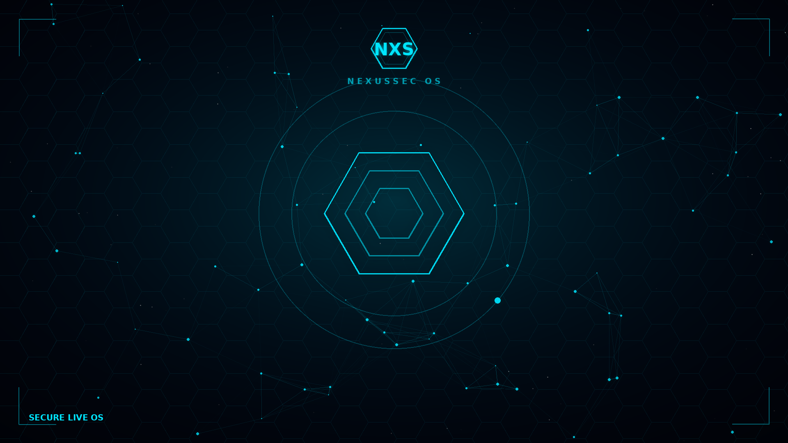
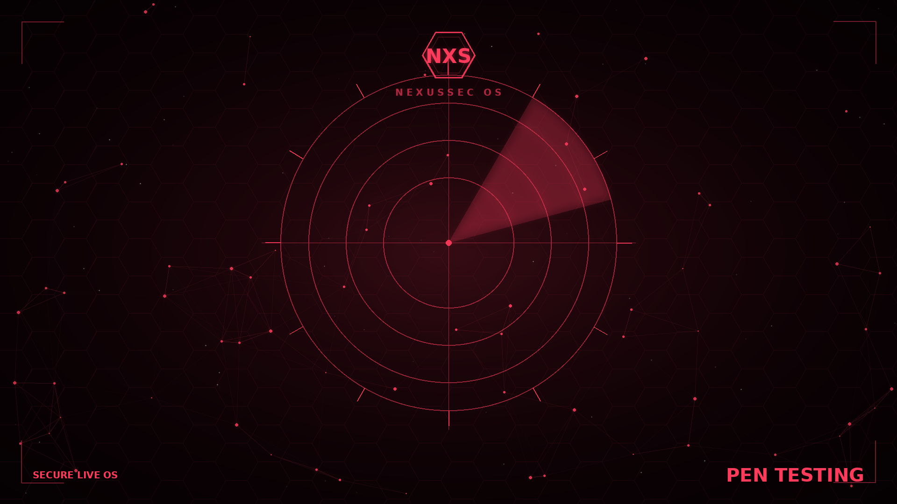
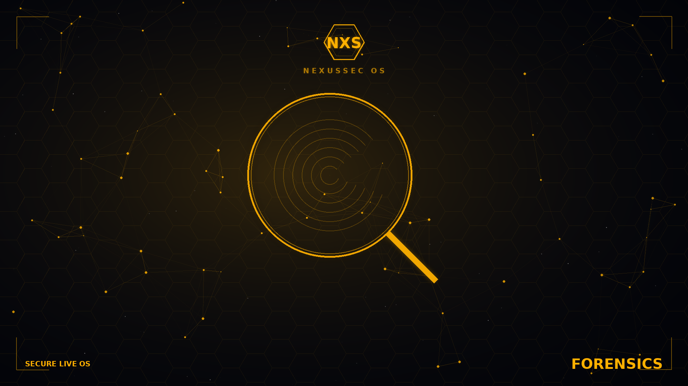
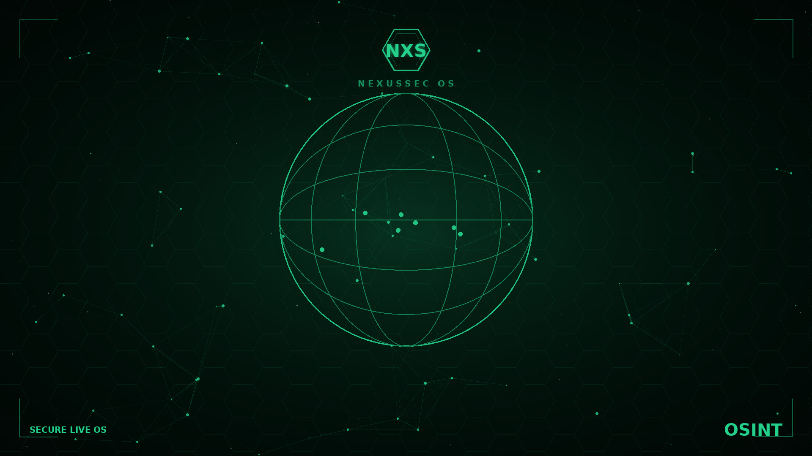
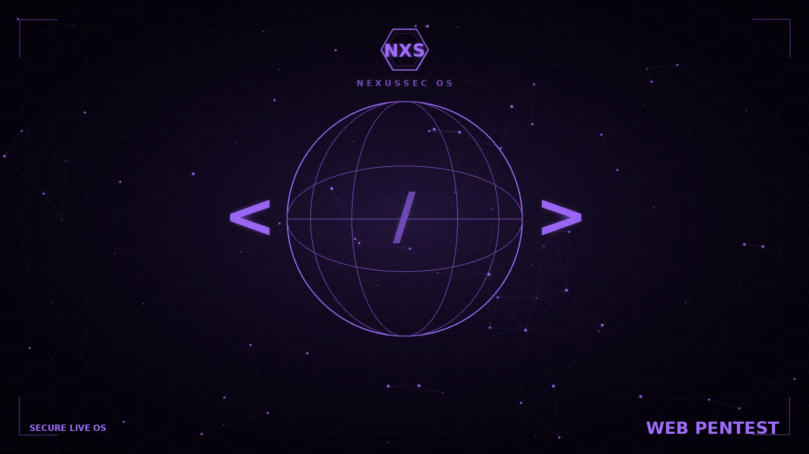

# NexusSecOS-Arsenal

Vetrina, download e **repository pacchetti** di **NexusSec OS** — distro Linux
live x86_64 per la **cybersecurity**, basata su Alpine (musl · apk · OpenRC),
desktop Openbox con pannello e Centro di Controllo nativi in Python (GTK3) e
**profili operativi dinamici** (Pen Testing · Digital Forensics · OSINT · Web).

L'idea: la copertura di strumenti di Kali/Parrot, ma con ISO molto più piccola e
tool **on-demand** (apk · container Podman · pip), ciascuno in **sandbox**.

## Download ISO

L'immagine ISO (~0.5 GB, boot BIOS+EFI) è pubblicata nella sezione
**[Releases](../../releases)** (i file ISO superano il limite del repository git,
quindi sono allegati come *release asset*).

In VirtualBox: VM Linux 64-bit, ≥ 2 GB RAM (3–4 GB se usi i container
Forensics/Web), boot dall'ISO.

## Screenshot

| Base | Pen Testing | Forensics |
|---|---|---|
|  |  |  |

| OSINT | Web |
|---|---|
|  |  |

> Anteprime degli sfondi per profilo. Screenshot del desktop (pannello, menu,
> icone per profilo) in arrivo.

## Repository pacchetti (apk)

I pacchetti compilati per NexusSec OS non presenti nei repo Alpine (es. `dmitry`,
`foremost`, `dirb`, `medusa`, `chkrootkit`, `rkhunter`, `scalpel`,
`bulk-extractor`) sono firmati e serviti via **GitHub Pages**:

```
https://dplusos21.github.io/NexusSecOS-Arsenal/
```

Per usarlo su un sistema Alpine/NexusSec:

```sh
# 1) fidati della chiave pubblica del repo
wget -O /etc/apk/keys/nexussecos-arsenal.rsa.pub \
  https://dplusos21.github.io/NexusSecOS-Arsenal/nexussecos-arsenal.rsa.pub

# 2) aggiungi il repo
echo "https://dplusos21.github.io/NexusSecOS-Arsenal" >> /etc/apk/repositories

# 3) aggiorna e installa
apk update
apk add dirb scalpel foremost
```

Su NexusSec OS questo è **già configurato**: la chiave è in `/etc/apk/keys/` e il
repo è aggiunto all'avvio, quindi `nxs-tool install <tool>` li scarica da qui.

## Licenza

I pacchetti mantengono le licenze dei rispettivi progetti upstream. Gli script e
i materiali di NexusSec OS sono rilasciati dal progetto NexusSec.
